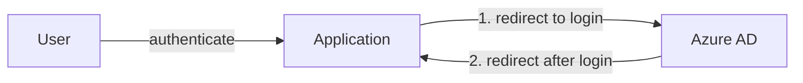
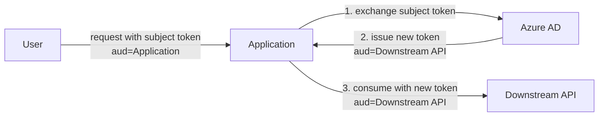
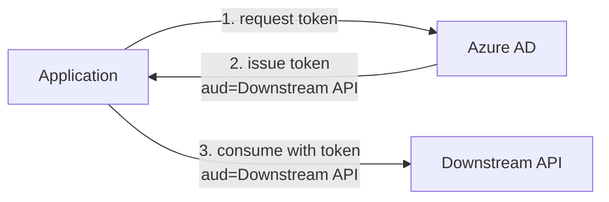

# Usage

## Use Cases

An Azure AD client allows your application to leverage Azure AD for authentication and/or authorization. The following
sections will describe the recommended flows and grants to be used for applications running on the platform.

### OpenID Connect Authorization Code Flow

This flow is used for signing in and authenticating end-users (NAV employees only) with single-sign on (SSO).



### OAuth 2.0 On-Behalf-Of Grant

This grant is used for machine-to-machine requests chains initiated by an end user. The end user's identity and
permissions should be propagated through each application.



Your application receives requests from a user.
These requests contain the user's token, known as the _subject token_.
The token has an audience (`aud`) [claim](../concepts/tokens.md#claims-validation) equal to _your own_ client ID.

In order to access a downstream API _on-behalf-of_ the user, we need a token that is [scoped](README.md#scopes) to the downstream API.
That is, the token's audience must be equal to the _downstream API's_ client ID.
We achieve this by exchanging the subject token for a new token.

The same principles apply if your application is a downstream API itself and needs to access another downstream API on-behalf-of the user.

See the how-to guide to [configure on-behalf of](../../../how-to/authnz/azure-ad/onbehalfof.md) in your application.


For further details, see [Microsoft identity platform and OAuth 2.0 On-Behalf-Of flow](https://docs.microsoft.com/en-us/azure/active-directory/develop/v2-oauth2-on-behalf-of-flow).

### OAuth 2.0 Client Credentials Grant

This grant is used for pure machine-to-machine authentication, i.e. interactions without an end user involved.



In order to access a downstream API, we need a token that is [scoped](README.md#scopes) to the downstream API.
That is, the token's audience must be equal to the _downstream API's_ client ID.

## Runtime Variables & Credentials

Your application will automatically be injected with both environment variables and files at runtime.
You can use whichever is most convenient for your application.

The files are available at the following path: `/var/run/secrets/nais.io/azure/`

#### Variables for Acquiring Tokens

These variables are used for acquiring tokens using the [client credentials grant](#oauth-20-client-credentials-grant) or the [on-behalf-of grant](#oauth-20-on-behalf-of-grant):

| Name                                 | Description                                                                                                       |
|:-------------------------------------|:------------------------------------------------------------------------------------------------------------------|
| `AZURE_APP_CLIENT_ID`                | [Client ID](../concepts/actors.md#client-id) that uniquely identifies the application in Azure AD.                |
| `AZURE_APP_CLIENT_SECRET`            | [Client secret](../concepts/actors.md#client-secret) for the application in Azure AD.                             |
| `AZURE_APP_JWK`                      | Optional. [Private JWK](../concepts/cryptography.md#private-keys) (RSA) for the application.                      |
| `AZURE_OPENID_CONFIG_TOKEN_ENDPOINT` | `token_endpoint` from the [metadata discovery document](../concepts/actors.md#token-endpoint).                    |
| `AZURE_APP_WELL_KNOWN_URL`           | The well-known URL for the [metadata discovery document](../concepts/actors.md#well-known-url-metadata-document). |

`AZURE_APP_WELL_KNOWN_URL` is optional if you're using `AZURE_OPENID_CONFIG_TOKEN_ENDPOINT` directly.

`AZURE_APP_JWK` contains a private key that can be used to sign JWT [_client assertions_](../concepts/actors.md#client-assertion). 
This is an alternative client authentication method that can be used instead of _client secrets_.
For further details, see Microsoft's documentation on [certificate credentials](https://learn.microsoft.com/en-us/azure/active-directory/develop/certificate-credentials).
The `aud` claim in the JWT assertions should be set to the value of the `AZURE_OPENID_CONFIG_TOKEN_ENDPOINT` environment variable. 


## Local Development

See also the [development overview](../overview/development.md) page.

### Token Generator

In many cases, you want to locally develop and test against a secured API (or [resource server](../concepts/actors.md#resource-server)) in the development environments.
To do so, you need a [token](../concepts/tokens.md#bearer-token) in order to access said API.

The service <https://azure-token-generator.intern.dev.nav.no> can be used in order to generate tokens in the development environments.

**Prerequisites**

1. The API application must be configured with [Azure enabled](../azure-ad/configuration.md). Using the [`nav.no` tenant](../azure-ad/README.md#tenants) is not supported.
2. You will need a [trygdeetaten.no user](../azure-ad/README.md#tenants) in order to access the service.
3. Pre-authorize the token generator service by adding it to the API application's [access policy](../azure-ad/configuration.md#pre-authorization):
    ```yaml
    spec:
      accessPolicy:
        inbound:
          rules:
            - application: azure-token-generator
              namespace: aura
              cluster: dev-gcp
    ```
4. Ensure that the API application has configured the appropriate [user access policies](../azure-ad/configuration.md#users) that grant your user access.

**Getting a token**

The Azure AD token generator supports two use cases:

1. The [on-behalf-of grant](../azure-ad/usage.md#oauth-20-on-behalf-of-grant) - for getting a token on-behalf-of a logged in end-user.
2. The [client credentials grant](../azure-ad/usage.md#oauth-20-client-credentials-grant) - for getting a machine-to-machine token.

Choose your use case:

1. For _on-behalf-of_: visit <https://azure-token-generator.intern.dev.nav.no/api/obo?aud=&lt;audience&gt;> in your browser.
2. For _client credentials_: visit <https://azure-token-generator.intern.dev.nav.no/api/m2m?aud=&lt;audience&gt;> in your browser.

Then:

1. Replace `<audience>` with the intended _audience_ of the token, in this case the API application.
    - The audience value must be on the form of `<cluster>:<namespace>:<application>`
    - For example: `dev-gcp:aura:my-app`
2. You will be redirected to log in at Azure AD (if not already logged in).
3. After logging in, you should be redirected back to the token generator and presented with a JSON response containing an `access_token`.
4. Use the `access_token` as a [Bearer token](../concepts/tokens.md#bearer-token) for calls to your API application.
5. Success!

### Test Clients

If [mocking](../overview/development.md#mocking) isn't sufficient, we also maintain some test clients for use in local development environments.

Note that the associated credentials may be rotated at any time.

As developers, you're responsible for treating these credentials as secrets. Never commit or distribute these to
version control or expose them to publicly accessible services.

Credentials are found in Vault under [/secrets/secret/.common/azure](https://vault.adeo.no/ui/vault/secrets/secret/list/.common/azure/)

The clients are configured with the following redirect URIs:

- `http://localhost:3000/oauth2/callback`

The clients are [pre-authorized](../azure-ad/configuration.md#pre-authorization) as follows:

- `test-app-1` is pre-authorized for `test-app-2`
- `test-app-2` is pre-authorized for `test-app-3`

They are otherwise equal to a [default client](../azure-ad/configuration.md).

---
description: Enabling authentication and authorization in internal web applications.
---

# Azure AD

The NAIS platform provides support for declarative provisioning of an [Azure AD application](https://docs.microsoft.com/en-us/azure/active-directory/develop/app-objects-and-service-principals).

Azure AD is our primary identity provider for internal applications.
It is used for authenticating and authorizing both users (employees) and applications.

## User Authentication

User authentication is performed by redirecting the user to Azure AD, where they will be prompted to sign in if not already authenticated.

Azure AD supports single sign-on (SSO) using the OpenID Connect Authorization Code flow.

[:octicons-arrow-right-24: Read more about the OpenID Connect Authorization Code flow](usage.md#openid-connect-authorization-code-flow)

## Application Authentication

Application authentication is performed by requesting a token from Azure AD.

There are two types of flows for requesting tokens, depending on the use case:

<div class="grid cards" markdown>

-   :octicons-server-24:{ .lg .middle } **Client Credentials**

    ---

    Machine-to-machine requests _without_ any end-user involvement.

    [:octicons-arrow-right-24: Get started with Client Credentials](usage.md#oauth-20-client-credentials-grant)

-   :octicons-person-24:{ .lg .middle } **On-Behalf-Of**

    ---

    Machine-to-machine requests _on behalf of_ an end-user.

    [:octicons-arrow-right-24: Get started with On-Behalf-Of](usage.md#oauth-20-on-behalf-of-grant)

</div>

## Concepts

The following describes a few core concepts in Azure AD referred to throughout this documentation.

### Tenants

A tenant represents an organization in Azure AD. Each tenant has their own separate sets of applications, users and groups.

An application in one tenant _cannot_ interact with other applications in _other_ tenants.

In order to log in to a tenant, you must use an account specific to that tenant.
This is indicated by the domain name of the account, which is the part after the `@` symbol.

NAV has two tenants in Azure AD:

| Tenant Name       | Description        |
|-------------------|--------------------|
| `nav.no`          | Production tenant  |                                                                                                                                                                                              |
| `trygdeetaten.no` | Development tenant |

!!! info "Logging into the `trygdeetaten.no` tenant"

     See <https://github.com/navikt/devuser-check/blob/main/README.md#faq> for instructions on acquiring a user and logging into this tenant. Otherwise, consult the `#tech-azure` Slack channel.

### Client ID

An Azure AD client has its own ID that uniquely identifies the client within a tenant, and is used in authentication requests to Azure AD.

Your application's Azure AD client ID is available at multiple locations:

1. The environment variable `AZURE_APP_CLIENT_ID`, available inside your application at runtime
2. In the Kubernetes resource - `kubectl get azureapp <app-name>`

You should generally **not** hard code or otherwise depend on the client ID of _other_ applications.

### Client Name

An Azure AD client has an associated name within a tenant. NAIS uses this name for lookups and identification.

All clients provisioned through NAIS will be registered in Azure AD using the following naming scheme:

```text
<cluster>:<namespace>:<app-name>
```

For example:

```text 
dev-gcp:aura:nais-testapp
```

### Scopes

A _scope_ is a parameter that is set when requesting a token. The term _scope_ in this case is synonymous with _permission_.

Generally, we will use it to indicate the intended _audience_ (or target, or recipient) for the requested token.
The audience is found in the `aud` claim in the JWT returned from Azure AD.
Its value should be equal to the recipient's unique client ID.

If you're requesting a token in order to consume another application, you must use the `/.default` scope.
The scope has the following format:

```text
api://<cluster>.<namespace>.<app-name>/.default
```

For example:

```text
api://dev-gcp.aura.nais-testapp/.default
```

The `/.default` scope indicates that your application is requesting _all_ available permissions granted by the _target application_.

### Groups

A _group_ in Azure AD is a collection of users.
The group itself can be assigned permissions that allows [access to applications](configuration.md#groups), data, and resources.
Members of the group will inherit all permissions that the group has been granted.

#### Group Management

There are primarily two ways to create and manage groups in Azure AD:

1. Self-service through Microsoft at <https://mygroups.microsoft.com>, or
2. "Identrutina" - consult the `#identrutina` Slack channel for assistance. You will also have to ask for the group to be synchronized to Azure AD.

#### Group Identifier

Each group is identified by its _object ID_, which is immutable and unique.

The group _name_ is **not** unique and should **never** be used by itself for authorization purposes.

In other words, two groups within the same tenant with the _exact same name_ will have _different object IDs_.
Groups with the same name will also have different IDs across different [tenants](#tenants).

#### Finding the group identifier

You can find the object ID for a given group in two ways.

First, make sure that you're logged in with an account with a domain that matches one of the [tenants](#tenants).
Then, do one of the following:

1. If you either own or are a direct member of the group, visit <https://mygroups.microsoft.com> and find the desired group.

    Browsing the detailed view for the group should reveal the ID in the address bar within the query parameter `objectId`.

2. Otherwise, visit the Groups view in the Azure AD Portal: <https://portal.azure.com/#view/Microsoft_AAD_IAM/GroupsManagementMenuBlade/~/AllGroups>

    You should be able to search and filter the list of groups.

    Consult the `#tech-azure` Slack channel for assistance if you do not have access to this page. Check the pinned/bookmarked posts first.
